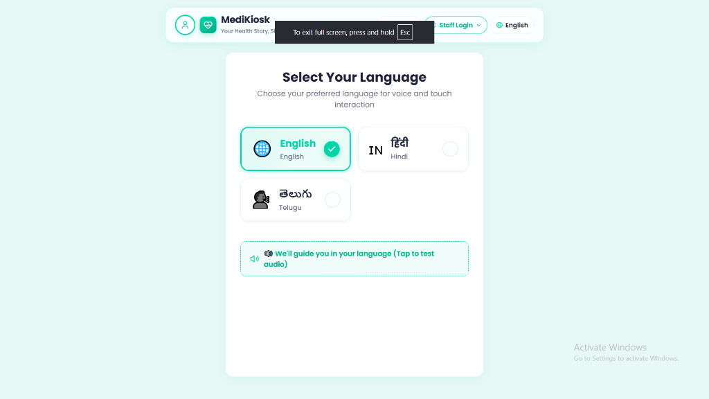
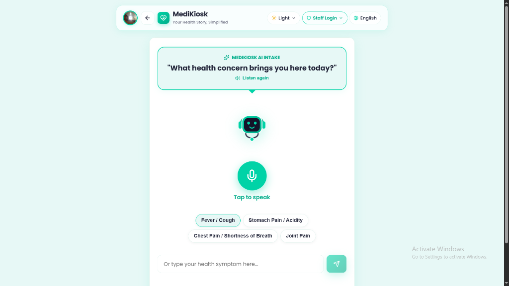
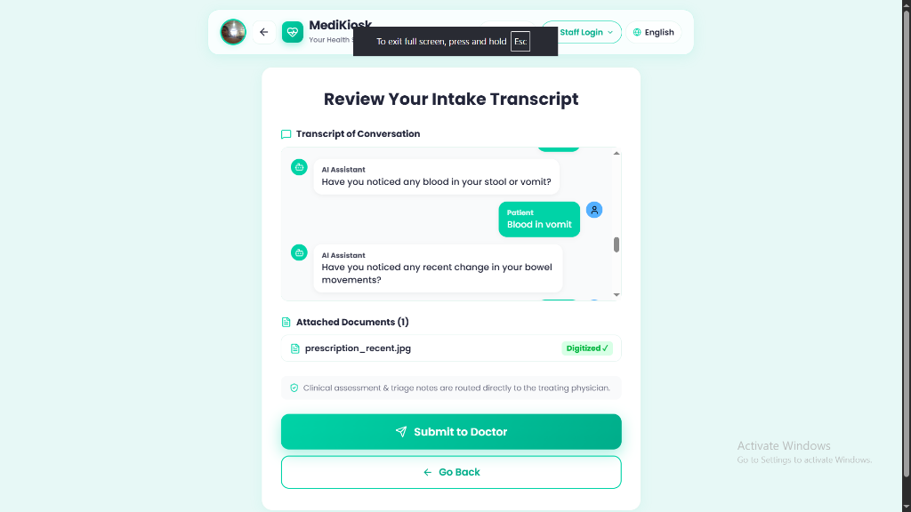
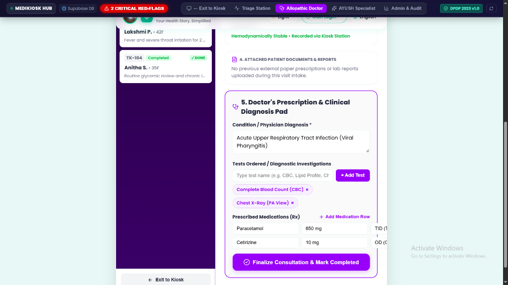

# ?? MediKiosk – AI Multimodal Clinical Intake & Document Digitization Platform

MediKiosk is an advanced, AI-powered clinical history and case-taking kiosk platform engineered for high-density hospital outpatient departments (OPDs) and AYUSH clinical institutions.

---

## ?? Step-by-Step System Workflow

* **Step 1 - Patient Authentication & Check-in:** Patients verify identity securely using ABHA ID or mobile number via SMS OTP.
* **Step 2 - Multilingual Voice/Touch Consultation:** Guided voice-to-text intake supporting multiple regional languages via the Web Speech API.
* **Step 3 - Clinical Adaptive Branching:** Dynamic questioning driven by the **SOCRES framework** (for allopathy) or **Dashavidha Pariksha** (for AYUSH).
* **Step 4 - Document Digitization:** Instant OCR and entity extraction from uploaded handwritten or printed prescriptions and lab reports.
* **Step 5 - Physician Handover:** Automated, structured clinical summary card generation for doctors to review in seconds.

---

## ?? Key Capabilities

* **Multilingual Voice Intake:** Supports Hindi, English, Tamil, Telugu, Kannada, Malayalam, and Bengali.
* **Real-Time Red-Flag Emergency Triage:** Instant detection of critical presentations (e.g., acute stroke signs, myocardial infarction, critical dyspnea) with immediate visual and audible alarms.
* **ABHA & DPDP Act 2023 Compliance:** Secure consent management, data privacy, and automatic session wiping upon completion.

---

## ??? Tech Stack

* **Frontend:** React, Vite, Web Speech API, High-Contrast Accessibility Design System
* **Backend:** Node.js, Express, TypeScript/ESM, Helmet, CORS, Multer
* **AI Core:** Google Gen AI SDK (`@google/genai`) using `gemini-2.5-flash`
* **Database & ORM:** PostgreSQL via Prisma ORM

---

## ?? Application Screenshots & Walkthrough

| Step 1: Kiosk Home & Language Select | Step 2: AI Voice Consultation Screen |
| :---: | :---: |
|  |  |
| *Patient selects preferred regional language & initiates session.* | *Interactive AI-driven medical intake and symptom logging.* |

| Step 3: Document OCR Upload | Step 4: Doctor Queue & Summary Portal |
| :---: | :---: |
|  |  |
| *Automated extraction of lab reports and prescriptions.* | *Structured clinical summaries and patient queue management.* |

---

## ?? Quick Start & Installation

### 1. Clone the Repository
```bash
git clone https://github.com/jayavardhankurasala/medikiosk.git
cd medikiosk
```
